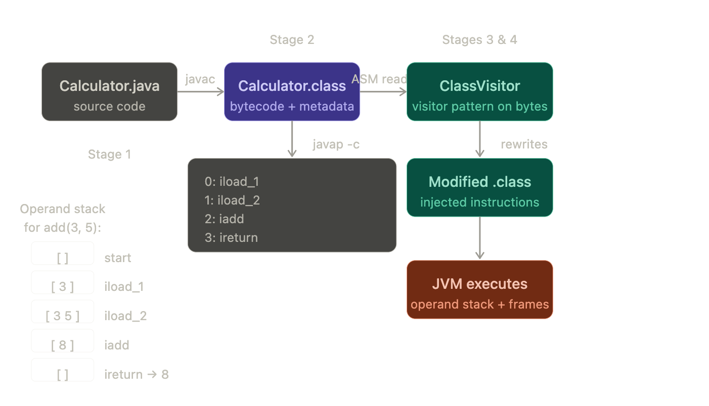

# 02-bytecode-javap

Hands-on project to understand bytecode - compile a Java class, disassemble it with javap, and manually modify bytecode using ASM library




- Add ASM to your classpath — no Maven needed for this lab:
```
bash# Download ASM 9.x (single JAR, ~120KB)
#java25
curl -L https://repo1.maven.org/maven2/org/ow2/asm/asm/9.6/asm-9.6.jar -o lib/asm-9.6.jar
curl -L https://repo1.maven.org/maven2/org/ow2/asm/asm-util/9.6/asm-util-9.6.jar -o lib/asm-util-9.6.jar

#java26
curl -L https://repo1.maven.org/maven2/org/ow2/asm/asm/9.7/asm-9.7.jar -o lib/asm-9.7.jar
curl -L https://repo1.maven.org/maven2/org/ow2/asm/asm-util/9.7/asm-util-9.7.jar -o lib/asm-util-9.7.jar

```

## Stage 1 — Read bytecode with javap
The class we'll dissect — deliberately has interesting constructs:
`src/Calculator.java`
```
# Compile
javac src/Calculator.java -d out/

# Layer 1: just the bytecode instructions (-c)
javap -c out/Calculator.class

# Layer 2: full detail — constant pool, stack sizes, local variable table
javap -c -verbose out/Calculator.class
```
Here is the annotated output for add() — read it alongside what javap prints:
```
public int add(int, int);
  descriptor: (II)I         ← method signature in JVM type notation
  flags: ACC_PUBLIC
  Code:
    stack=2, locals=3       ← max operand stack depth=2, local vars: this(0), a(1), b(2)
    0: iload_1              ← push local[1] (a=3) onto stack       → stack: [3]
    1: iload_2              ← push local[2] (b=5) onto stack       → stack: [3, 5]
    2: iadd                 ← pop two ints, push their sum         → stack: [8]
    3: ireturn              ← pop top of stack, return it          → stack: []
```

Now look at describe() — this one is educational:

You'll see javac compiled name + " computed: " + result into a StringBuilder chain — invokespecial, invokevirtual, ldc. The source looks like simple string concatenation but the bytecode reveals the actual object creation. In Java 9+ you'll see invokedynamic instead — javac offloads string concat to a bootstrap method. Both are worth reading.


JVM type descriptors — you'll see these everywhere in javap output:
```
I  → int          J  → long         D  → double
F  → float        Z  → boolean      B  → byte
C  → char         S  → short        V  → void
L<classname>;     → object reference  e.g. Ljava/lang/String;
[I                → int array
(II)I             → method taking two ints, returning int
(Ljava/lang/String;)V  → method taking String, returning void
```

## Stage 2 — Programmatic bytecode inspector
This uses ASM's TraceClassVisitor to print a human-readable breakdown of any .class file — and then we layer our own visitor on top to print opcode explanations.

```
javac --release 17 -cp lib/asm-9.7.jar:lib/asm-util-9.7.jar src/Stage2_Inspector.java -d out/
java -cp out:lib/asm-9.7.jar:lib/asm-util-9.7.jar Stage2_Inspector
```

## Stage 3 — Rewrite bytecode with ASM

This is the practical payoff. We inject timing code around every method — without touching `Calculator.java`. This is exactly how frameworks like Spring AOP, JaCoCo (test coverage), and Mockito work.
The transformer intercepts every method call and injects:

Before the first instruction: `long start = System.nanoTime()`
Before every return instruction: print elapsed time

```
javac -cp lib/asm-9.7.jar:lib/asm-util-9.7.jar src/Stage3_AsmTransformer.java -d out/
java  -cp out:lib/asm-9.7.jar:lib/asm-util-9.7.jar Stage3_AsmTransformer

# Now inspect what ASM injected
javap -c out/Calculator_timed.class
```

You'll see the `injected invokestatic java/lang/System.nanoTime`, `lstore`, `lload`, and `lsub` instructions sitting inside `add` and `factorial` — bytecode you never wrote in Java.

## Stage 4 — Plug ASM into your Phase 1 custom loader

This is where it all connects. Your `Stage2CustomLoader` from Phase 1 read raw bytes and called `defineClass`. Now we intercept those bytes before `defineClass` and transform them on the fly — giving you a transparent, load-time instrumentation pipeline.

Make sure Calculator.class is not in classpath, otherwise AppClassLoader found it first and your custom loader never got to `findClass`.
```
# Create a plugins dir and move Calculator there
mkdir -p plugins
mv out/Calculator.class plugins/
```

```
javac -cp lib/asm-9.7.jar:lib/asm-util-9.7.jar \
      src/Stage3_AsmTransformer.java src/Stage4_LoaderIntegration.java -d out/
java  -cp out:lib/asm-9.7.jar:lib/asm-util-9.7.jar Stage4_LoaderIntegration
```